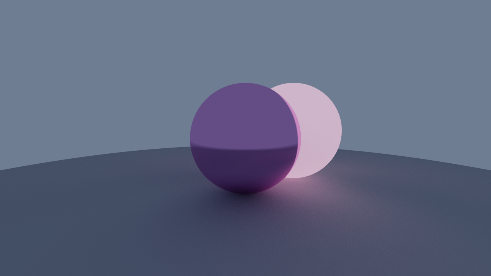

# RayTracing


## Warning
**Current light representation is extremly simplified and probably not accurate, if you want professional renders, please use [Blender](https://www.blender.org/) or any other software.**

## Usage
**Launch parameters:**
- `-w` or `--width` - Render image width
- `-h` or `--height` - Render image height
- `-s` or `--samples` - Samples count
- `-b` or `--bounces` - Maximum number of ray bounces
- `-t` or `--threads` - Thread count
- `-i` or `--input` - Scene JSON file
- `-o` or `--output` - Output file

**The `--input` parameter is required!**

**Example:**
```shell
./RayTracing -w 512 -h 512 -s 256 -b 16 -t 8 -i scene.json -o render.png
```
This will render a 512 by 512 image with 256 samples and 16 bounces on 8 threads with `scene.json`, as an input file, and save it as `render.png`

## Build dependencies
- A C++ Compiler capable of building C++20 code
- CMake 3.14 or newer
- GLM library (`glm` on Arch-based distros)
- JSON for Modern C++ (`nlohmann-json` on Arch-based distros)
```shell
sudo pacman -S cmake glm nlohmann-json
```

## Build
**Currently only Linux is supported, but everything should build fine on Windows, although, you would need to manually download all required libraries.**
```shell
git clone https://github.com/Olek47/RayTracing.git
cd RayTracing
cmake -S . -B build -G 'Unix Makefiles'
cmake --build build
```
If you want, you can use different CMake generators, for example Ninja build system or Microsoft Visual Studio on Windows.

## Example scene
```json
{
    "CameraPos": [0.0, 2.0, 6.0],
    "CameraLookAt": [0.0, 1.0, 0.0],
    "CameraVFOV": 45.0,
    "SkyColor": "#99b2e5",
    "SkyIntensity": 0.5,
    "EnableToneMapping": true,
    "Materials": [
        {
            "Albedo": "#e396d9",
            "Roughness": 0.05
        },
        {
            "Albedo": "#cc85aa",
            "Roughness": 1.0,
            "EmissionColor": "#cc85aa",
            "EmissionPower": 1.0
        },
        {
            "Albedo": 0.6,
            "Roughness": 1.0
        }
    ],
    "Spheres": [
        {
            "Position": [0.0, 1.0, 0.0],
            "Radius": 1.0,
            "MatIndex": 0
        },
        {
            "Position": [1.0, 1.0, -1.0],
            "Radius": 1.0,
            "MatIndex": 1
        },
        {
            "Position": [0.0, -50.0, 0.0],
            "Radius": 50.0,
            "MatIndex": 2
        }
    ]
}
```

## Learning resources
- [The Cherno's Ray Tracing youtube series](https://youtube.com/playlist?list=PLlrATfBNZ98edc5GshdBtREv5asFW3yXl&feature=shared)
- [Ray Tracing in One Weekend](https://raytracing.github.io/)
- [Sebastian Lague Coding Adventure](https://youtu.be/Qz0KTGYJtUk?feature=shared)